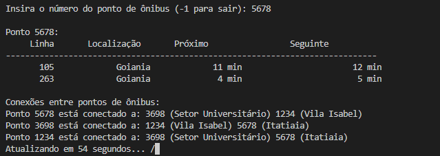

# Sistema de Rotas de Ônibus

Esse código simula um sistema de gerenciamento de rotas de ônibus usando grafos. Ele permite adicionar pontos de ônibus, definir conexões entre eles e simular o movimento de ônibus ao longo dessas rotas.

## Funcionalidades

- Adicionar pontos de ônibus ao sistema, especificando nome, localização e coordenadas geográficas.
- Estabelecer conexões entre os pontos de ônibus para definir rotas de ônibus.
- Adicionar ônibus a pontos de ônibus específicos com tempos estimados de chegada.
- Atualizar dinamicamente os tempos de chegada dos ônibus simulando o movimento em tempo real.
- Exibir os ônibus que estão a caminho de um ponto de ônibus específico.
- Mostrar as conexões entre os pontos de ônibus para visualização das rotas disponíveis.

## Estrutura do Projeto

- `main.cpp`: Contém a implementação principal do sistema, incluindo a definição da classe `BusRouteGraph` e a função `main`.

## Como Utilizar

1. **Compilação e Execução:**
   - Compile o código usando um compilador C++ 
   `g++ rota.cpp -o programa.exe`

   - Execute o programa compilado 
    `./programa.exe`

2. **Interagindo com o Sistema:**
   - Ao iniciar, você poderá inserir o número de um ponto de ônibus para verificar os ônibus a caminho desse ponto.
   - O sistema atualiza dinamicamente os tempos de chegada dos ônibus e mostra as conexões entre os pontos de ônibus.

## Exemplo

Utilizando grafos abaixo podemos ver a conexão entre as rotas, levando em consideração o ponto, o ônibus, bairro e cidade. 

O tempo é simulado para que o usuário pudesse ver o andamento do ônibus, desse modo a cada 1 minuto a tela são atualizados os minutos. 

Ao digitar o ponto errado, retorna é reiniciado para que possa inserir novamente. O sistema só inicia com o código correto. 

